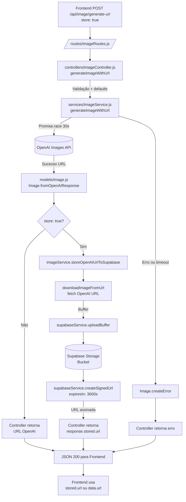
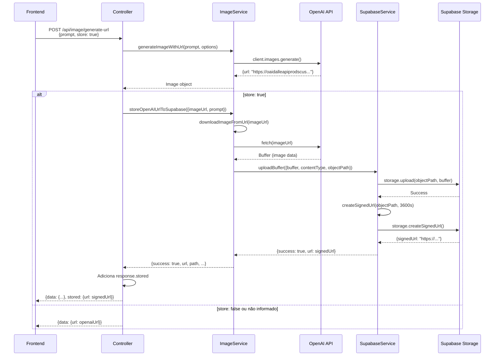

# Integração com OpenAI para geração de imagens
- **Stack**: Node.js + Express em CommonJS.
- **Serviço central**: `services/imageService.js`.
- **Modelo de domínio**: `models/image.js`.
- **Rotas expostas**: `routes/imageRoutes.js`.
- **Armazenamento temporário**: `services/supabaseService.js` (Supabase Storage).

## Visão geral
- A aplicação oferece um conjunto de endpoints para gerar imagens via OpenAI e armazenar temporariamente no Supabase Storage.
- O serviço encapsula a SDK oficial (`openai`) para reutilizar o cliente com a chave presente em `OPENAI_API_KEY`.
- A resposta preferencial é uma URL hosted pela OpenAI (`response_format: "url"`), reduzindo tempo de resposta em comparação com payloads base64.
- Quando solicitado (`store: true`), as imagens são automaticamente baixadas da OpenAI e armazenadas no Supabase Storage, retornando uma URL assinada válida por 1 hora.

## Configuração necessária
- Variável de ambiente `OPENAI_API_KEY` definida no `.env`.
- Variáveis de ambiente do Supabase (opcional, mas recomendado para armazenamento temporário):
  - `SUPABASE_URL`: URL do projeto Supabase
  - `SUPABASE_SERVICE_ROLE_KEY`: Chave de serviço (Service Role Key) do Supabase
  - `SUPABASE_BUCKET`: Nome do bucket (padrão: `openai-images`)
- Dependências instaladas:
  - `openai` (já presente em `package.json`)
  - `@supabase/supabase-js` (já presente em `package.json`)

## Fluxo de requisição (com armazenamento no Supabase)

### Fluxo principal: `POST /api/image/generate-url` com `store: true`

1. **Frontend faz requisição** com `store: true`:
   ```javascript
   POST /api/image/generate-url
   {
     prompt: "uma casa no campo",
     model: "dall-e-3",
     size: "1024x1024",
     quality: "standard",
     style: "vivid",
     store: true  // ← Flag para armazenar no Supabase
   }
   ```

2. **Controller valida** o payload e aplica defaults (`dall-e-3`, `1024x1024`, etc.).

3. **ImageService gera imagem** na OpenAI:
   - Chama `generateImageWithUrl()` que executa `client.images.generate()` com `response_format: "url"`.
   - Timeout de 30s com `Promise.race`.
   - Retorna objeto `Image` com a URL da OpenAI.

4. **Controller verifica flag `store`**:
   - Se `store: true`, extrai a URL original da OpenAI.
   - Chama `imageService.storeOpenAIUrlToSupabase()`.

5. **ImageService baixa a imagem** da URL da OpenAI:
   - `downloadImageFromUrl()` faz `fetch(imageUrl)` → converte para `Buffer`.
   - Extrai `content-type` e `size`.

6. **ImageService faz upload para Supabase**:
   - Gera caminho: `openai/{prompt-sanitizado}-{timestamp}.{ext}`.
   - Chama `supabaseService.uploadBuffer()` para fazer upload no bucket.
   - O bucket é criado automaticamente se não existir (`ensureBucketExists()`).

7. **SupabaseService gera URL assinada**:
   - Chama `createSignedUrl()` com expiração de 3600 segundos (1 hora).
   - Retorna URL assinada válida por 1 hora.

8. **Controller retorna resposta** com URL do Supabase:
   ```json
   {
     "success": true,
     "data": { ... },
     "stored": {
       "provider": "supabase",
       "url": "https://...supabase.co/storage/v1/object/sign/...",
       "path": "openai/casa-no-campo-1234567890.png",
       "contentType": "image/png",
       "size": 123456,
       "expiresInSeconds": 3600
     }
   }
   ```

9. **Frontend recebe e usa a URL**:
   - Prioriza `response.stored?.url` (Supabase) sobre `response.data.url` (OpenAI).
   - Usa a URL assinada para exibir e baixar a imagem.

## Diagrama de fluxo (com Supabase)



### Fluxo detalhado do Supabase



## Papel da controller
- **Validação**: garante que `prompt` esteja presente e organiza parâmetros opcionais (`model`, `size`, `quality`, `style`) com defaults.
- **Orquestração**: decide se deve armazenar no Supabase baseado na flag `store` do payload.
- **Timeout adicional**: envolve a chamada do serviço em um `Promise.race` de 30 s para evitar requisições penduradas mesmo que o serviço demore.
- **Integração com Supabase**: quando `store: true`, chama `storeOpenAIUrlToSupabase()` após gerar a imagem e adiciona `response.stored` à resposta.
- **Padronização da resposta**: converte o retorno em `image.toAPIResponse()`, define o status HTTP correto e mantém logs.
- **Tratamento de erro**: captura exceções inesperadas, registra contexto e devolve `Image.createError` para preservar o formato padrão do contrato. Se o armazenamento no Supabase falhar, retorna a URL da OpenAI como fallback.

## Decisões principais e motivação
- **CommonJS e classe de serviço**: o código original em ESM foi convertido para CommonJS para alinhar com o restante do backend. A classe `ImageService` permite compartilhar o mesmo cliente configurado com `process.env.OPENAI_API_KEY`.
- **`response_format: "url"`**: optamos por abandonar `b64_json` porque as respostas em base64 chegavam lentas e pesadas. Usar URLs hospedadas pela OpenAI acelera a entrega.
- **Supabase Storage para armazenamento temporário**: URLs da OpenAI expiram rapidamente e têm restrições de CORS. Armazenar no Supabase permite:
  - URLs assinadas válidas por 1 hora (configurável)
  - Contorno de problemas de CORS
  - Melhor controle sobre downloads
  - Histórico temporário de imagens geradas
- **Upload automático quando `store: true`**: o sistema detecta automaticamente a flag `store` e faz o upload para o Supabase sem intervenção adicional, mantendo a API simples.
- **Timeout explícito**: adicionamos `Promise.race` com 30 s para evitar requisições penduradas quando a OpenAI demora.
- **Fallback para URL da OpenAI**: se o armazenamento no Supabase falhar (configuração ausente ou erro), o sistema retorna a URL original da OpenAI como fallback, garantindo que a requisição não falhe completamente.
- **Modelo `Image`**: centraliza transformação da resposta (sucesso e erro), garantindo consistência entre endpoints e facilitando ajustes em um único lugar.
- **Métodos especializados**: `generateImageWithUrl` gera imagem com URL, `downloadImageFromUrl` baixa imagem da URL, e `storeOpenAIUrlToSupabase` orquestra o processo de upload ao Supabase.

## Endpoints suportados

### `POST /api/image/generate-url`
Gera imagem via OpenAI e retorna URL. Opcionalmente armazena no Supabase se `store: true`.

**Request:**
```json
{
  "prompt": "uma casa no campo",
  "model": "dall-e-3",
  "size": "1024x1024",
  "quality": "standard",
  "style": "vivid",
  "store": true
}
```

**Response (com `store: true`):**
```json
{
  "success": true,
  "data": {
    "url": "https://oaidalleapiprodscus.blob.core.windows.net/...",
    "created": 1234567890,
    "model": "dall-e-3",
    "size": "1024x1024",
    "quality": "standard",
    "style": "vivid"
  },
  "stored": {
    "provider": "supabase",
    "url": "https://xxx.supabase.co/storage/v1/object/sign/...",
    "path": "openai/casa-no-campo-1234567890.png",
    "contentType": "image/png",
    "size": 123456,
    "expiresInSeconds": 3600
  }
}
```

**Response (sem `store` ou `store: false`):**
```json
{
  "success": true,
  "data": {
    "url": "https://oaidalleapiprodscus.blob.core.windows.net/...",
    ...
  }
}
```

### `POST /api/image/download-proxy`
Faz proxy do download usando a URL retornada pela OpenAI (contorna CORS). Retorna o arquivo binário diretamente.

## Considerações sobre URLs temporárias

### URLs da OpenAI
- As URLs devolvidas pela OpenAI expiram rapidamente (geralmente após alguns minutos).
- Podem ter restrições de CORS que impedem downloads diretos do frontend.
- Por isso fornecemos o proxy (`downloadImageProxy`) para servir o arquivo através do backend quando necessário.

### URLs do Supabase (recomendado)
- URLs assinadas válidas por 1 hora (configurável via `expiresInSeconds`).
- Sem problemas de CORS, permitindo downloads diretos do frontend.
- Permite melhor controle e auditoria de acesso.
- O bucket é privado por padrão (`public: false`), garantindo segurança.

### Processo de armazenamento
1. **Download da OpenAI**: `downloadImageFromUrl()` faz `fetch(imageUrl)` → converte para `Buffer`.
2. **Upload para Supabase**: `uploadBuffer()` envia o buffer para o bucket especificado.
3. **Geração de URL assinada**: `createSignedUrl()` gera URL temporária válida por 1 hora.
4. **Retorno ao frontend**: URL assinada é incluída em `response.stored.url`.

### Fallback e tratamento de erros
- Se o Supabase não estiver configurado (`SUPABASE_URL` ou `SUPABASE_SERVICE_ROLE_KEY` ausentes), o sistema retorna apenas a URL da OpenAI.
- Se o upload falhar, o sistema loga o erro mas ainda retorna a URL da OpenAI como fallback.
- O frontend prioriza `response.stored?.url` (Supabase) sobre `response.data.url` (OpenAI).

### Estrutura de arquivos no bucket
- Caminho padrão: `openai/{prompt-sanitizado}-{timestamp}.{ext}`
- Prompt sanitizado: convertido para lowercase, removidos caracteres especiais, limitado a 60 caracteres.
- Extensão detectada automaticamente do `content-type` (png, jpg, bin).

## Serviços auxiliares

### `services/supabaseService.js`
- **Inicialização**: Cria cliente Supabase com `SUPABASE_URL` e `SUPABASE_SERVICE_ROLE_KEY`.
- **`ensureBucketExists()`**: Verifica e cria o bucket automaticamente se não existir.
- **`uploadBuffer()`**: Faz upload de buffer para o bucket especificado.
- **`createSignedUrl()`**: Gera URL assinada válida por período configurável (padrão: 1 hora).

### `services/imageService.js`
- **`generateImageWithUrl()`**: Gera imagem na OpenAI e retorna URL.
- **`downloadImageFromUrl()`**: Baixa imagem da URL e converte para Buffer.
- **`storeOpenAIUrlToSupabase()`**: Orquestra o processo completo: download → upload → URL assinada.

## Possíveis extensões
- Persistir metadados de geração no banco usando o modelo `Image`.
- Adicionar fila/background job para requisições com prompts pesados.
- Implementar limpeza periódica do bucket Supabase (deletar arquivos antigos após expiração).
- Adicionar suporte a múltiplos buckets por ambiente (dev/prod).
- Enriquecer logs com IDs de correlação para rastrear requisições end-to-end.
- Adicionar cache de URLs assinadas para evitar regeneração desnecessária.
- Implementar rate limiting por usuário/IP.
